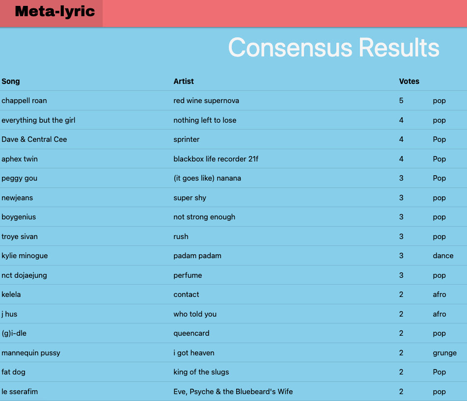

# Project 4: Song Critical consensus generator

* This app takes end of year top songs lists from various online music publications and generates a critical consensus by counting the number of occurences for a song across all publications.
* The user can then filter results by genre and display the top songs by genre according to critics.
* The user can then generate a spotify playlist based on the results returned 

## Screenshots
### Home page
 
 

## Technologies used: 
* JavaScript
* HTML 
* CSS
* Postgresql
* Django
* Beautiful soup
* 
* 

## APIs used:
* 

## Getting Started
* Navigate to home page
* Scroll to generate consensus button and click
* Wait for results to be scraped and organised
* Review results
* Click the select genre drop down menu to filter results by genre 
* To generate a playlist, input the following:
-   Playlist name
-   Playlist length
-   Spotify id

## Next steps
* Update styling 
* Tidy-up code
* Update scraping to include publications with html tags other than h2

